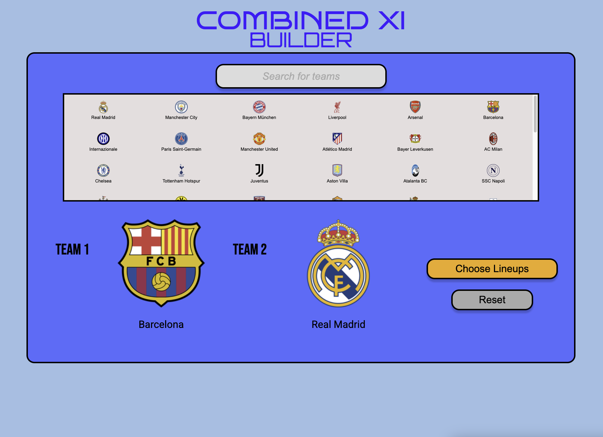
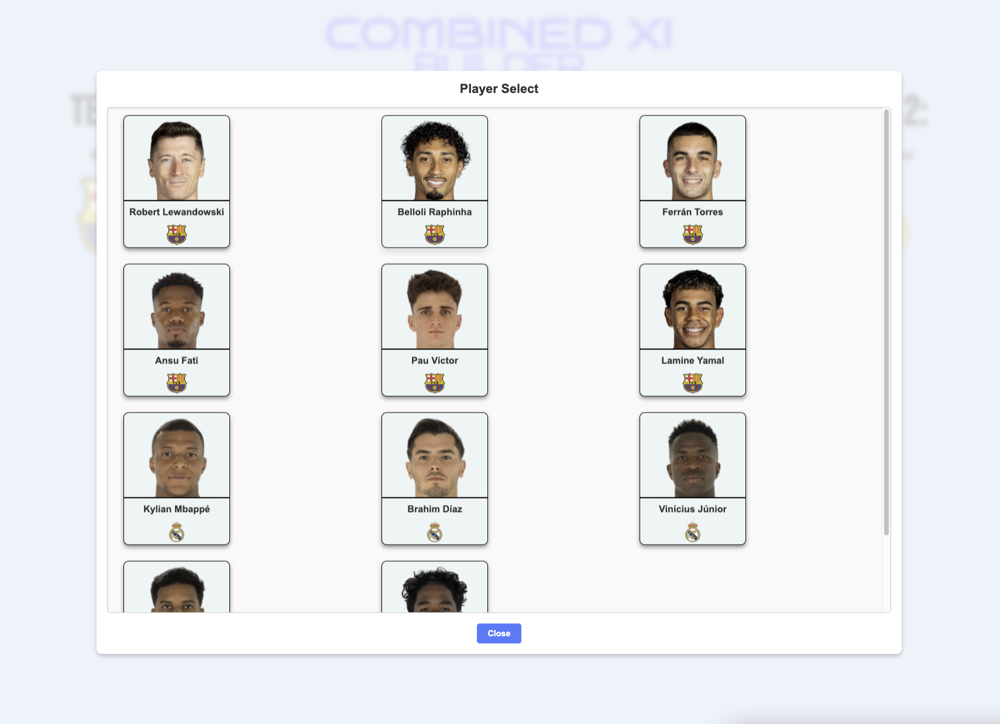
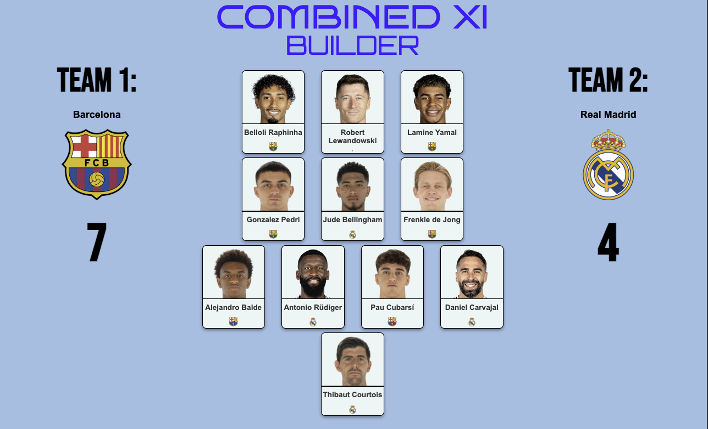

# Combined XI Builder

## Description
The **Combined XI Builder** is a web-based tool for football fans to create a combined starting eleven from two selected teams. Built using **Flask**, this tool allows users to pick teams, choose lineups, and generate a visual representation of the best possible squad from both sides.

## Features
- Select two teams from a list of clubs.
- Automatically fetch team logos and details.
- Interactive lineup selection.
- Visual representation of the final Combined XI.
- Displays the number of players selected from each team.

## Screenshots
### Team Selection Screen


### Lineup Selection Screen


### Final Combined XI


## Installation & Usage
### 1. Clone the Repository
```bash
git clone https://github.com/pwick15/combined-xi-builder.git
cd https://github.com/pwick15/combined-xi-builder.git
```
### 2. Install Dependencies
```bash
pip install -r requirements.txt
```
### 3. Run the Application
```bash
python app.py
```
### 4. Access the Web App
Open your browser and visit:
```bash
http://127.0.0.1:5000
```
